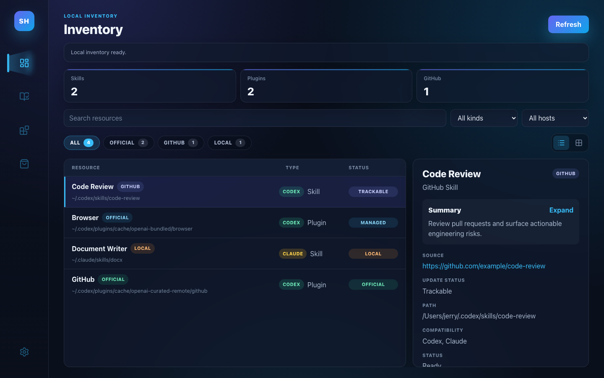

# Skill Hub

> A cross-platform desktop app for managing Codex and Claude skills and plugins


[English](README.en.md) · [中文](README.md)



## Table of Contents

- [Introduction](#introduction)
- [Core Features](#core-features)
  - [Resource Management](#resource-management)
  - [Market Discovery](#market-discovery)
  - [Install and Update](#install-and-update)
  - [Personalization](#personalization)
- [Download and Install](#download-and-install)
- [Market Architecture](#market-architecture)
  - [Sorting](#sorting)
- [Scanning](#scanning)
- [GitHub Source Matching](#github-source-matching)
- [Update Detection](#update-detection)
- [Development Guide](#development-guide)
- [Repository Layout](#repository-layout)
- [Privacy](#privacy)
- [License](#license)

## Introduction

Skill Hub is a cross-platform desktop app built with Tauri 2 (Rust + React) for managing local Codex and Claude skills and plugins, and discovering or installing new ones from the GitHub market. It scans local resource folders, classifies where each resource came from (official, GitHub, or local), and helps you clearly distinguish skills by source.

## Core Features

### Resource Management

- Inventory view for Codex and Claude skills/plugins.
- Separate Skills, Plugins, Market, and Settings sections.
- Source classification: Official, GitHub, and Local, with source-tag filtering and per-view counts.
- Details panel with summary, source URL, update status, path, and compatibility.
- Manual extra skill path scanning.

### Market Discovery

- Four-layer market architecture (L1 built-in index → L2 remote index → L3 user sources → L4 paste link), with content out of the box and progressively wider discovery.
- Top-level Market tabs switch between **Plugin** and **Skill**. The Added section shows locally installed resources for the selected type.
- Paste any GitHub repo or resource URL to discover and install instantly.
- Sort by hotness (default), Stars, or Name, with rank badges for the top three.
- Market prefetch and cache: background warm-up on startup, 30-minute local cache, refresh only on manual request.
- Market refresh uses an animated Rose Three loader with per-source loading status.
- Large Market result sets are rendered in batches to keep tab switching responsive.

### Install and Update

- One-click install from the Market to Codex or Claude, downloaded and verified over HTTPS.
- Install safety guards: only public GitHub HTTPS/SSH URLs, sensitive files filtered out, writes confined to the host root with no overwriting of existing targets.
- Update detection for GitHub-backed skills by comparing the remote `SKILL.md` hash; the old copy goes to the system trash rather than being permanently deleted.
- In-app update checks through GitHub Releases `latest.json` and signed updater artifacts.
- macOS local install workflow that replaces `/Applications/Skill-Hub.app` without reinstalling through a DMG each iteration.

### Personalization

- Language setting for English and Chinese.
- Dark and light themes.

## Download and Install

Download the latest release from [GitHub Releases](https://github.com/JerryLiu-uestc/skill-hub/releases):

- **macOS**: download the `.dmg` or `.app.tar.gz`, drag into `/Applications`.
- **Windows**: download the `.msi` or `.exe` installer and run it.
- **Linux**: download the `.AppImage` or `.deb` and install accordingly.

## Market Architecture

Skill Hub's market uses a four-layer architecture, progressing from offline-ready to instant discovery. The app has content on first open regardless of network state.

| Layer | Source | Speed | Description |
|-------|--------|-------|-------------|
| L1 Built-in index | Bundled in app | 0ms | 17 official skills (all from anthropics/skills), 0 plugins, works out of the box with zero network requests |
| L2 Remote index | GitHub Actions daily | ~1s | Auto-updated daily, distributed via raw.githubusercontent.com, no rate limit |
| L3 User sources | User-added GitHub repos | ~3-5s | Real-time discovery via GitHub API, optional Token to raise the limit |
| L4 Paste link | User-pasted URL | Instant | Paste any GitHub link and Skill Hub acts as a download tool |

**Default market sources (L3).** New installs seed three sources:

- [`anthropics/skills`](https://github.com/anthropics/skills)
- [`obra/superpowers`](https://github.com/obra/superpowers)
- [`anthropics/claude-plugins-official`](https://github.com/anthropics/claude-plugins-official)

**L3 rate limits and the optional token.** The anonymous GitHub API allows only 60 requests/hour, which discovery can exhaust quickly. Add a personal access token under **Settings → GitHub Token** to raise the limit to 5000 requests/hour. The token is stored locally only and never uploaded anywhere except as the `Authorization` header on GitHub API calls. A single source failing (rate limit or network) does not fail the whole Market — other sources and the built-in index still load.

**L2 remote index generation.** The repository uses a GitHub Actions workflow (`.github/workflows/update-market-index.yml`) on a cron schedule `0 6 * * *` (daily at UTC 06:00) to auto-generate `index.json` and publish it to gh-pages. The app fetches it via `raw.githubusercontent.com`, which does not consume the GitHub API quota.

**L4 paste link.** Paste any GitHub repo URL (`https://github.com/owner/repo`) or a specific resource URL (`.../tree/<branch>/skills/<name>`, `.../tree/<branch>/plugins/<name>`, etc.) into the input at the top of the Market and click **Discover**. The found resources are merged into the Market and the repo is remembered as a source for future refreshes. Use the plus button next to the search box to add a long-lived market source.

**Market loading and cache.** On app startup, Skill Hub starts a delayed background Market prefetch after the local inventory has begun loading. If a valid cache exists, the Market uses it immediately instead of calling GitHub. Cache entries are valid for 30 minutes and are keyed by the configured market source list. Opening the Market tab does not trigger a GitHub refresh. Use **Refresh** to force a fresh fetch. Market lists are shown in batches to avoid a large one-time render. During refresh, the page shows an animated Rose Three loader plus per-source progress rows.

**Discovery and install flow.** When discovering a repository, Skill Hub makes one `git/trees?recursive=1` GitHub API call to list every `SKILL.md` and plugin manifest path, reads each resource's name and description over `raw.githubusercontent.com` (not rate-limited), and makes one repo-metadata call to attach the star count. Entries are deduplicated by repository URL and marked as installed when a local resource matches by source URL, `SKILL.md` hash, or name. On install, the repository tarball is downloaded over HTTPS from `codeload.github.com`, extracted, located, and copied into the target host directory.

### Sorting

The Market supports three sort orders:

- **Hotness (default)**: `hotness = stars × 1.0 + recency_bonus`, where recency_bonus decays by the repo's update time — +100 within 7 days, +50 within 30 days, +20 within 90 days. This surfaces recently active, high-quality repos.
- **Stars**: sorted by the source repository's stargazers. GitHub has no per-skill metric, so skills from the same repo share that number (the star count carries a tooltip noting this).
- **Name**: alphabetical order.

The top three entries get rank badges.

## Scanning

Skill Hub scans common Codex/Claude roots for the current operating system. Environment variables `CODEX_HOME` and `CLAUDE_HOME` always take precedence.

Default candidates include:

- `~/.codex/skills`, `~/.codex/plugins`
- `~/.claude/skills`, `~/.claude/plugins`
- macOS: `~/Library/Application Support/Codex`, `~/Library/Application Support/Claude`
- Windows: `%APPDATA%\Codex`, `%LOCALAPPDATA%\Codex`, `%APPDATA%\Claude`, `%LOCALAPPDATA%\Claude`
- Linux: `${XDG_CONFIG_HOME:-~/.config}/codex`, `${XDG_CONFIG_HOME:-~/.config}/claude`

You can add extra skill roots in Settings. A directory is treated as a skill when it contains `SKILL.md`. A Codex plugin is detected by `.codex-plugin/plugin.json`; a Claude plugin is detected by `plugin.json`.

Source classification uses this order:

1. GitHub: `.git/config`, `SKILL.md` frontmatter, or matched GitHub index metadata.
2. Official: Codex system skills, bundled plugin content, or curated plugin cache content.
3. Local: manually added, custom, or external resources that do not match a known GitHub source.

## GitHub Source Matching

GitHub matching is opt-in from Settings. When enabled, Skill Hub downloads one or more public index JSON files and compares them locally against installed skills. Local skill files and paths are not uploaded.

An index can be an array:

```json
[
  {
    "name": "ppt-master",
    "repository": "https://github.com/example/ppt-master",
    "description": "AI-driven multi-format SVG content generation system.",
    "skillSha256": "optional-sha256-of-SKILL.md"
  }
]
```

Or wrapped in a `skills` field:

```json
{
  "skills": [
    {
      "name": "ppt-master",
      "repository": "https://github.com/example/ppt-master"
    }
  ]
}
```

Matching confidence:

- `GitHub verified`: `SKILL.md` SHA-256 matches the index.
- `GitHub probable`: name and description match the index.

## Update Detection

### Skill Updates

For any GitHub-backed skill, the details panel shows a **Check for updates** action. Skill Hub fetches the remote `raw.githubusercontent.com/.../SKILL.md` (resolving the branch and subpath from the source URL, falling back from `main` to `master`), hashes it, and compares it with the local `SKILL.md`:

- `Up to date`: local and remote hashes match.
- `Update available`: hashes differ.
- `Could not determine`: no remote `SKILL.md` could be read.

When an update is available, the **Update** action downloads and validates the new copy into a temporary directory first, then moves the existing skill to the system trash and installs the fresh copy. If the download or validation fails, the installed skill is left untouched, and the old copy always goes to the trash rather than being permanently deleted.

### App Updates

The in-app **Check for updates** button reads `latest.json` from GitHub Releases. When building a release, Tauri generates the updater tarball and signature; then run:

```bash
cd app
npm run release:latest-json
```

The script uses the current `tauri.conf.json` version and updater signatures to generate `latest.json`. For a local single-machine build it reads the current platform's updater artifact; in the GitHub Actions release flow it merges Windows, Linux, and macOS artifacts into one `latest.json` with multiple `platforms` entries.

## Development Guide

### Prerequisites

- Node.js
- Rust
- Windows packaging requires a Windows runner, Linux packaging requires a Linux runner, and macOS packaging requires a macOS runner. The bundled GitHub Actions release workflow builds on each operating system.

### Install Dependencies

```bash
cd app
npm install
```

### Development Commands

Run the Vite development server (serves the web UI at `http://127.0.0.1:1420/` for browser-based development; does **not** update the installed macOS app in `/Applications`):

```bash
npm run dev
```

Run checks:

```bash
npm run test
npm run lint
npm run format:check
cd src-tauri && cargo test
```

### Build

Build the app bundle:

```bash
npm run build:app
```

On macOS, install the latest local build into `/Applications`:

```bash
npm run install:local
```

Use this command whenever you want the installed desktop app (`/Applications/Skill-Hub.app`) to reflect local code changes. The script builds the Tauri bundle, quits the currently running Skill Hub app, replaces `/Applications/Skill-Hub.app`, clears quarantine metadata when possible, and reopens the app. If the browser at `http://127.0.0.1:1420/` shows a change but the desktop app does not, you are looking at two different runtime targets — run `npm run install:local` and reopen the desktop app.

Build the desktop release artifacts:

```bash
npm run build:desktop
```

The local build script is cross-platform. It reads the updater signing key from `TAURI_SIGNING_PRIVATE_KEY`; if that is unset, it tries `TAURI_SIGNING_PRIVATE_KEY_PATH`, defaulting to `~/.skill-hub/updater.key`.

### Release

The repository includes `.github/workflows/release.yml`. Pushing a version tag such as `v0.4.0`, or manually triggering the workflow, will:

1. Build the Tauri app on Ubuntu, Windows, and macOS runners.
2. Upload installers, updater bundles, and `.sig` signature files for each platform.
3. Merge all `.sig` files into one `latest.json`.
4. Publish everything to the same GitHub Release.

Configure these repository secrets first:

- `TAURI_SIGNING_PRIVATE_KEY`
- `TAURI_SIGNING_PRIVATE_KEY_PASSWORD` if the private key is password-protected

Create a release manually:

```bash
git tag v0.4.0
git push origin v0.4.0
```

## Repository Layout

- `app/src`: React UI.
- `app/src-tauri/src`: Tauri/Rust backend for scanning, source matching, installs, and deletion.
- `app/scripts`: local install and DMG post-processing scripts.
- `app/src/*.test.tsx` and `app/src/*.test.ts`: frontend tests.
- `app/src-tauri/src/lib.rs`: backend logic and Rust tests.

## Privacy

GitHub matching is disabled by default. When enabled, the app downloads configured index URLs and performs matching locally. It does not upload local skill directories, file contents, or paths. The GitHub token is stored locally only and never uploaded anywhere except as the `Authorization` header on API calls.

## License

This project is licensed under the [MIT License](LICENSE), copyright 2025-2026 JerryLiu-uestc.
